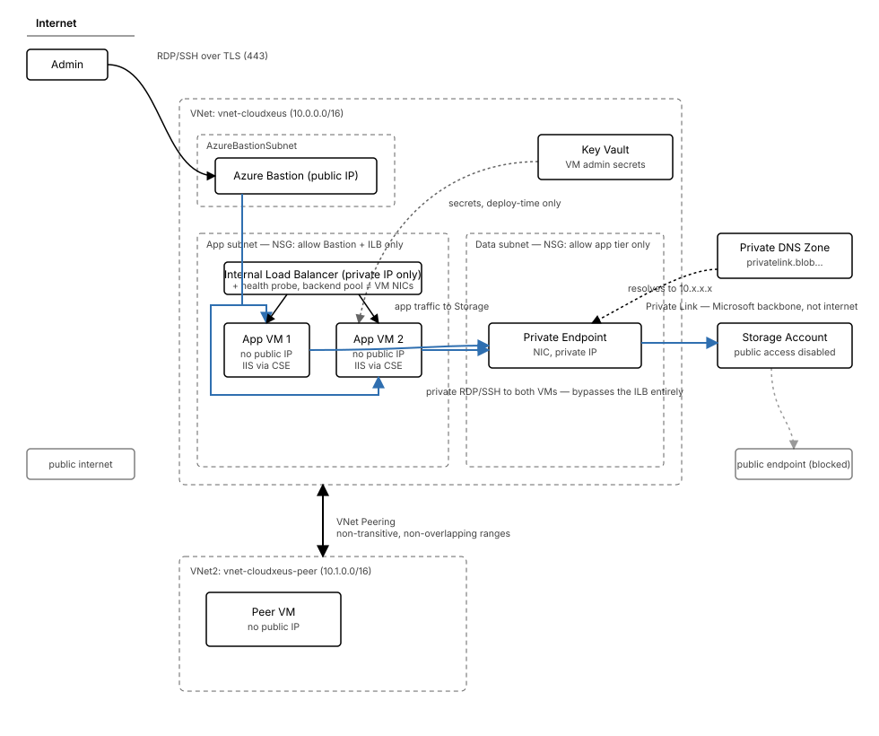

# CloudXeus Case Study (Azure Bicep)

CloudXeus is a fictional company losing time and consistency to manual, click-through Azure deployments — every environment built slightly differently, with no repeatable record of what was actually deployed. This project rebuilds their core network, compute, and storage architecture as Infrastructure as Code with Bicep: modular, parameterized, and redeployable on demand, instead of hand-clicked through the portal. Every fix in this repo was driven by an actual Azure error message, never guessed.

## What's in it

| Area | What was built |
|---|---|
| **Networking** | Two peered VNets — `vnet-dev-eus` (`10.0.0.0/16`) and `vnet-test-eus` (`10.1.0.0/16`), deliberately non-overlapping. Four subnets: web, db, `AzureBastionSubnet`, and the peered test VNet's app subnet |
| **Security** | A shared NSG for the web/db subnets (RDP restricted to one real admin IP), and a **second, dedicated NSG** for `AzureBastionSubnet` carrying Azure's mandatory Bastion-compliant rule set |
| **Compute** | Two private-only Windows Server VMs with IIS installed via a Custom Script Extension, plus a Linux VM in the peered test VNet |
| **Load balancing** | A Standard internal load balancer — frontend, health probe, and backend pool wired to both Windows VMs' NICs |
| **Remote access** | Azure Bastion (Standard SKU) — no VM in this project has a public IP |
| **Storage** | A storage account with a private blob container holding the CSE install script, referenced via a time-boxed, read-only SAS token. Network hardening (service endpoints, private endpoints, outbound NSG rules, endpoint policies, encryption) was done hands-on via the portal — see [Known limitations](#known-limitations) |
| **Secrets** | Both VM sets' admin passwords are pulled from an existing Key Vault via parameter-file `reference` blocks — no secret value ever appears in source control |

## Architecture



## What broke, and what it taught

**Parameter binding and naming**
- A casing mismatch between a Bicep parameter and its parameters-file key is quietly dangerous specifically when that parameter has a default value — the deployment doesn't error at all, it silently falls back to the wrong value with no warning (`winWebConfig` vs. `winWebconfig`).
- The same mismatch on a parameter with *no* default fails loudly instead — an interactive prompt or a hard error (`testvnet`/`testvent`, `linuxWebAdminPassword`/`linuxWebadminPassword`). Both classes need checking the same way, even though the failure mode looks completely different.
- A Key Vault `reference` block's `secretName` has to be a sibling of `keyVault`, not nested inside it — get the nesting wrong and Azure rejects it with a genuine `InvalidRequestContent` error, not a Bicep-time warning.

**Dependency ordering**
- Three separate times — Bastion, the internal load balancer, and the Linux VM — a module referenced a subnet by ID and picked up an implicit Bicep dependency on the *VNet* module. But the actual subnet resource is created by the *NSG* module, since subnets are attached there to enable per-subnet NSG association. Each one needed an explicit `dependsOn` added by hand; Bicep's automatic dependency inference only follows symbolic references, not "this ID happens to belong to a resource created somewhere else."
- Declaring the same subnet both inline inside the VNet resource *and* as a separate child resource caused a real `AnotherOperationInProgress` failure from concurrent writes to the same underlying object. A subnet needs exactly one owner.

**Azure Bastion specifically**
- Bastion's subnet needs its own dedicated NSG with a fixed, mandatory rule set (HTTPS from Internet/GatewayManager/AzureLoadBalancer inbound, RDP/SSH outbound to the VNet, plus Bastion's own instance-to-instance ports) — reusing a generic NSG built for other subnets fails outright with `NetworkSecurityGroupNotCompliantForAzureBastionSubnet`.
- Filtering one subnet out of an NSG's attachment list (to give it its own NSG instead) needed Bicep's `filter()`/`map()` functions — its `if` loop-filter clause only works inside resource/module loops, not a plain variable comprehension.

**Everything else**
- A fabricated Windows Server image SKU (`2026-Datacenter`) that simply didn't exist — caught only by actually deploying and reading Azure's rejection, then confirmed against the real list with `az vm image list-skus` before picking a replacement.
- A hardcoded command override pointed at a script filename (`setup-iis.ps1`) that never matched the actual uploaded file (`install-iis.ps1`). The module's own default was already correct — the override was the only thing wrong, and deleting it (rather than fixing the typo in two places) removed the chance of the two drifting apart again.
- A fullwidth Unicode `@` (visually identical to a normal `@`) silently broke `az deployment ... --parameters @file.json` across several consecutive terminal commands before being caught.
- Blob-level storage operations (`az storage blob upload`, SAS generation) fail under Azure AD auth for an identity with full ARM management access but no data-plane RBAC role on the storage account — worked around with the account key directly, rather than granting a new role assignment.

## The morning-after incident

Woke up, saw both VMs "running" in the portal, and — in a moment of panic about runaway overnight cost — deleted the storage account and both VMs. They weren't actually running: they'd been deliberately *deallocated* the night before specifically to avoid overnight compute charges, and a deallocated VM still shows up in the resource list rather than disappearing. Recovered cleanly with no real damage: Bicep is idempotent, so a straight redeploy recreated everything from the same template, since nothing in this project held state that mattered beyond the infrastructure definition itself.

## Design decisions

- **Private-only VMs, Bastion for all admin access.** No VM in this project has a public IP.
- **RDP restricted to one real IP address**, not left open to the internet.
- **Secrets never touch source control.** Both VM admin passwords are Key Vault `reference` blocks; the CSE's storage access uses a time-boxed, read-only SAS token rather than the storage account key.
- **Non-overlapping VNet address spaces** (`10.0.0.0/16` and `10.1.0.0/16`), chosen deliberately so peering would be valid from the start.
- **Verify from real state, every time.** Every fix in this project was driven by actual Azure error text or a live `az` check — never guessed from what "should" work.

## Known limitations

- **Storage network hardening isn't codified in Bicep.** Service endpoints, private endpoints, outbound NSG rules, endpoint policies, and encryption were configured directly in the portal as an iterative step, not yet folded back into Bicep. `storage.bicep` doesn't define any of it — a redeploy of this template won't recreate or guarantee those settings.
- **`dev.parameters.json`'s `scriptUri` ships as a placeholder** (`REPLACE_WITH_SAS_URL`), not a live value. A real SAS URL has to be generated against the deployed storage account before the Custom Script Extension step will succeed — see below.

## Prerequisites

- An existing resource group to deploy into.
- An existing Key Vault, with a secret named `vmAdminPassword` holding the value used for both VM sets' admin passwords, referenced from `dev.parameters.json`.

## Deploying this yourself

This deploys in two passes because of a genuine chicken-and-egg limitation: the Custom Script Extension needs a SAS-signed URL to the install script, but that URL can't be minted until the blob exists — and the blob's container is itself created by this same deployment.

1. `az deployment group create --resource-group <rg> --template-file main.bicep --parameters @params/dev.parameters.json` — the first pass will fail at the CSE step, since `scriptUri` is a placeholder; everything else will succeed.
2. Upload `scripts/install-iis.ps1` to the `scripts` container the deployment just created.
3. Generate a read-only SAS token for that blob (`az storage blob generate-sas`) and replace the placeholder in `dev.parameters.json`.
4. Re-run the same deploy command — it only needs to retry the failed extension resources.

## Cost and teardown

```bash
az group delete --name rg-cloudxeus-dev --yes --no-wait
```

Bastion (Standard SKU) and the internal load balancer both bill continuously while deployed — deallocating the VMs alone doesn't stop either charge. Don't leave this running unattended.

## Built with

Azure Bicep (modules, parameters, user-defined types, loops), Virtual Networks and VNet Peering, Network Security Groups, Azure Bastion, Standard Internal Load Balancer, Windows and Linux Virtual Machines, Custom Script Extension, Azure Storage (Blob), Azure Key Vault, Azure CLI.
