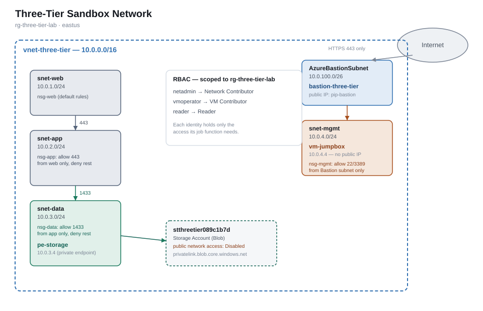

# Three-Tier Sandbox Network

A segmented Azure network built entirely by hand with the Azure CLI — no public IP anywhere except the management entry point — to practice the core patterns behind AZ-104 and SC-500 before automating any of it with Bicep.



## What's in it

| Resource | Purpose |
|---|---|
| `vnet-three-tier` (10.0.0.0/16) | Private network, split into five subnets |
| `snet-web` / `snet-app` / `snet-data` | The three tiers, each isolated by NSG |
| `snet-mgmt` + `vm-jumpbox` | A VM with **no public IP**, reachable only through Bastion |
| `AzureBastionSubnet` + `bastion-three-tier` | The only path into the network from the internet |
| `stthreetier089c1b7d` + `pe-storage` | A storage account with public network access disabled, reachable only via a private endpoint inside `snet-data` |
| `netadmin` / `vmoperator` / `reader` | Three mock identities, each with a different least-privilege role scoped to this resource group |

## Design decisions

**Segmentation, not a flat network.** Each tier only accepts inbound traffic from the tier directly in front of it: web → app on 443, app → data on 1433. Everything else between tiers is explicitly denied, overriding Azure's default `AllowVnetInBound` rule that would otherwise let every subnet talk to every other subnet freely.

**No public IP on the jump-box.** Instead of RDP/SSH exposed to the internet — a classic attack surface — the VM is reachable only through Azure Bastion, and `nsg-mgmt` only trusts traffic from Bastion's own subnet range. The trade-off is Bastion's hourly cost (see below) versus eliminating a directly internet-facing management port.

**Private endpoint over public storage access.** The storage account has public network access fully disabled. The only way to reach it is a private endpoint inside `snet-data`, backed by a private DNS zone so the storage account's normal hostname resolves to its private IP instead of a public one from inside the VNet.

**Three roles instead of one Owner.** `netadmin` (Network Contributor), `vmoperator` (Virtual Machine Contributor), and `reader` (Reader) each hold only the access their function needs, scoped to this resource group specifically — not the subscription.

## Cost and teardown

Everything here lives in one resource group so it tears down atomically:

```powershell
az group delete --name rg-three-tier-lab --yes --no-wait
```

Azure Bastion is the one resource that bills hourly with no "stop" option — it's deleted along with everything else the moment the command above runs, which is why it's never left up between sessions.

The three mock Entra ID identities are tenant-level objects, not part of the resource group, so they're removed separately:

```powershell
az ad user delete --id "netadmin@<tenant-domain>"
az ad user delete --id "vmoperator@<tenant-domain>"
az ad user delete --id "reader@<tenant-domain>"
```

## Built with

Azure CLI only — no portal clicking, no IaC yet. That's deliberate: this project is the "do it by hand" rep before Project 2 rebuilds this exact network in Bicep with a CI/CD pipeline.
